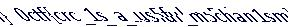

# Check Research and Check again

**Flag:** `0ctf{crc_1s_a_us5ful_m5chan1sm}`

Given the phrase `the last thing you did wrong is what needs to be corrected first`, we look at the IEND chunk at the end of the image. We find some garbage data after IEND and so remove it.

Then, we open the file in PhotoPea and find a distorted image.


We try and shift around the rows of the image to get the uncorrupted file. With an offset of 7 per row, we get the full image and the flag.

```py
from PIL import Image

def undistort_image(input_file, output_file, base_shift=7):
    # Open the image
    img = Image.open(input_file)
    pixels = img.load()

    # Get the dimensions of the image
    width, height = img.size

    # Create a new image with the same dimensions
    undistorted_img = Image.new('RGB', (width, height))
    undistorted_pixels = undistorted_img.load()

    # Iterate over each row
    for y in range(height):
        shift_amount = (y + 1) * base_shift  # Calculate the shift amount for the current row
        for x in range(width):
            # Calculate the source pixel position
            src_x = (x + shift_amount) % width
            undistorted_pixels[x, y] = pixels[src_x, y]

    # Save the un-distorted image
    undistorted_img.save(output_file)

# Define the input and output file names
input_file = 'corrupted_flag.png'
output_file = 'undistorted_flag.png'

# Call the function to undistort the image
undistort_image(input_file, output_file)
```


