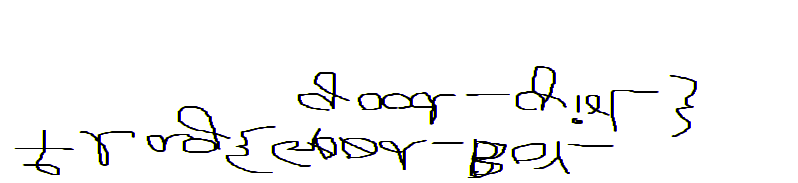
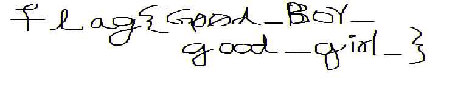
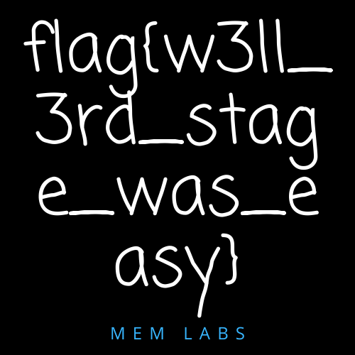

# MemLabs 1

**Flag 1:** `flag{th1s_1s_th3_1st_st4g3!!}`

**Flag 2:** `flag{G00d_Boy_good_girL}`

**Flag 3:** `flag{w3ll_3rd_stage_was_easy}`

Running `imageinfo`, we find the profile to likely be `Win7SP1x64`.

```
root@eb8cd8e7a2e5:~# volatility -f dumps/MemoryDump_Lab1.raw imageinfo
Volatility Foundation Volatility Framework 2.6
INFO    : volatility.debug    : Determining profile based on KDBG search...
          Suggested Profile(s) : Win7SP1x64, Win7SP0x64, Win2008R2SP0x64, Win2008R2SP1x64_24000, Win2008R2SP1x64_23418, Win2008R2SP1x64, Win7SP1x64_24000, Win7SP1x64_23418
                     AS Layer1 : WindowsAMD64PagedMemory (Kernel AS)
                     AS Layer2 : FileAddressSpace (/root/dumps/MemoryDump_Lab1.raw)
                      PAE type : No PAE
                           DTB : 0x187000L
                          KDBG : 0xf800028100a0L
          Number of Processors : 1
     Image Type (Service Pack) : 1
                KPCR for CPU 0 : 0xfffff80002811d00L
             KUSER_SHARED_DATA : 0xfffff78000000000L
           Image date and time : 2019-12-11 14:38:00 UTC+0000
     Image local date and time : 2019-12-11 20:08:00 +0530
```

Running `pslist`, we find `cmd.exe` running.

```
root@eb8cd8e7a2e5:~# volatility -f dumps/MemoryDump_Lab1.raw --profile Win7SP1x64 pslist
Volatility Foundation Volatility Framework 2.6
Offset(V)          Name                    PID   PPID   Thds     Hnds   Sess  Wow64 Start                          Exit
------------------ -------------------- ------ ------ ------ -------- ------ ------ ------------------------------ ------------------------------
0xfffffa8002222780 cmd.exe                1984    604      1       21      1      0 2019-12-11 14:34:54 UTC+0000
```

Running `consoles`, we get a base64 encoded string. Decoding it gives us the first flag.

```
root@eb8cd8e7a2e5:~# volatility -f dumps/MemoryDump_Lab1.raw --profile Win7SP1x64 consoles
Volatility Foundation Volatility Framework 2.6
**************************************************
ConsoleProcess: conhost.exe Pid: 2692
Console: 0xff756200 CommandHistorySize: 50
.
.
.
C:\Users\SmartNet>St4G3$1
ZmxhZ3t0aDFzXzFzX3RoM18xc3Rfc3Q0ZzMhIX0=
Press any key to continue . . .
```

```
root@eb8cd8e7a2e5:~# echo ZmxhZ3t0aDFzXzFzX3RoM18xc3Rfc3Q0ZzMhIX0= | base64 -d
flag{th1s_1s_th3_1st_st4g3!!}
```

Through `pslist`, we also see that WinRAR and Microsoft Paint are running as well.

```
0xfffffa80022bab30 mspaint.exe            2424    604      6      128      1      0 2019-12-11 14:35:14 UTC+0000
0xfffffa8001010b30 WinRAR.exe             1512   2504      6      207      2      0 2019-12-11 14:37:23 UTC+0000
```

We dump the Paint memory

```
volatility -f dumps/MemoryDump_Lab1.raw --profile Win7SP1x64 memdump -p 2424 -D .
```

Since it's Paint, we can assume the file is an image somewhere. To extract raw image data from memory dumps, we rename the dump from `2424.dmp` to `2424.data`, and open it in GIMP. We find an image like this



Flipping and rotating it, we get the flag.



Now, on to the final flag. We know WinRAR was running so we search for RAR files in the filesystem.

```
root@eb8cd8e7a2e5:~# volatility -f dumps/MemoryDump_Lab1.raw --profile Win7SP1x64 filescan | grep 'rar$'
Volatility Foundation Volatility Framework 2.6
0x000000003fa3ebc0      1      0 R--r-- \Device\HarddiskVolume2\Users\Alissa Simpson\Documents\Important.rar
0x000000003fac3bc0      1      0 R--r-- \Device\HarddiskVolume2\Users\Alissa Simpson\Documents\Important.rar
0x000000003fb48bc0      1      0 R--r-- \Device\HarddiskVolume2\Users\Alissa Simpson\Documents\Important.rar
```

We find a suspicious file `Important.rar` and extract it using `dumpfiles`. We then see it is password-protected.

```
root@eb8cd8e7a2e5:~# volatility -f dumps/MemoryDump_Lab1.raw --profile Win7SP1x64 dumpfiles -Q 0x000000003fa3ebc0 -D .
```

```
root@eb8cd8e7a2e5:~# rar e file.None.0xfffffa8001034450.dat

RAR 7.00   Copyright (c) 1993-2024 Alexander Roshal   26 Feb 2024
Trial version             Type 'rar -?' for help

Archive comment:
Password is NTLM hash(in uppercase) of Alissa's account passwd.


Extracting from file.rar
```

We get the hash through `hashdump` and find out the NTLM hash is the one in the last column. So the password becomes `F4FF64C8BAAC57D22F22EDC681055BA6`.

```
root@eb8cd8e7a2e5:~# volatility -f dumps/MemoryDump_Lab1.raw --profile Win7SP1x64 hashdump
Volatility Foundation Volatility Framework 2.6
Administrator:500:aad3b435b51404eeaad3b435b51404ee:31d6cfe0d16ae931b73c59d7e0c089c0:::
Guest:501:aad3b435b51404eeaad3b435b51404ee:31d6cfe0d16ae931b73c59d7e0c089c0:::
SmartNet:1001:aad3b435b51404eeaad3b435b51404ee:4943abb39473a6f32c11301f4987e7e0:::
HomeGroupUser$:1002:aad3b435b51404eeaad3b435b51404ee:f0fc3d257814e08fea06e63c5762ebd5:::
Alissa Simpson:1003:aad3b435b51404eeaad3b435b51404ee:f4ff64c8baac57d22f22edc681055ba6:::
```

Using the password, we get the flag in an image file.

```
~/Downloads $ rar e file.rar

RAR 7.00   Copyright (c) 1993-2024 Alexander Roshal   26 Feb 2024
Trial version             Type 'rar -?' for help

Archive comment:
Password is NTLM hash(in uppercase) of Alissa's account passwd.


Extracting from file.rar

Enter password (will not be echoed) for flag3.png:

Extracting  flag3.png                                                 OK
All OK
```


