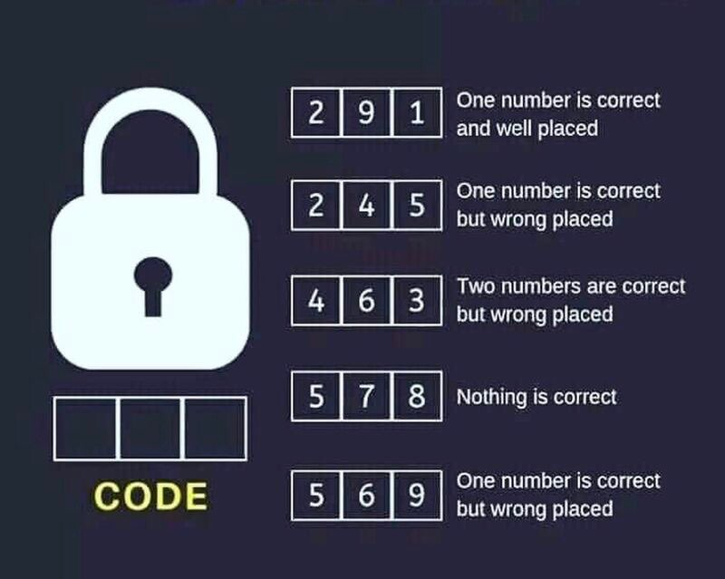

# sonda

We're given a binary file that takes in a seed and uses `srand` to make a valid passphrase. Using z3 we find out the seed to be **17**, the passphrase to be `6n|L0V"6>f\$JE{uY`, and thus the valid flag to be `flag{6n|L0V"6>f\$JE{uY}`

```py
import ctypes
from z3 import *

# Load the C standard library
libc = ctypes.CDLL('libc.so.6')

# Declare the functions we'll use
libc.srand.argtypes = [ctypes.c_uint]
libc.rand.restype = ctypes.c_int

# Create a Z3 solver instance
solver = Solver()

# Declare the seed variable
seed = Int('seed')

# Add the constraints for seed
solver.add(seed % 17 == 0)
solver.add(seed <= 20)
solver.add(seed > 0)

# Check for a valid seed
if solver.check() == sat:
    model = solver.model()
    seed_value = model[seed].as_long()
    print(f"Valid seed found: {seed_value}")

    # Now, set the random seed using libc's srand and generate the sequence
    libc.srand(seed_value)
    ptr = [2 * seed_value + libc.rand() % (5 * seed_value)]
    for i in range(1, seed_value):
        v5 = ptr[i - 1]
        ptr.append(v5 + libc.rand() % 94 + 33)

    # Create a new Z3 solver for the string s
    solver2 = Solver()
    s = [Int(f's[{i}]') for i in range(seed_value)]

    # Add the constraints for the string s
    for j in range(seed_value):
        v9 = Sum(s[:j+1])
        solver2.add(v9 == ptr[j])

    # Add the constraints for s to be valid ASCII characters
    for i in range(seed_value):
        solver2.add(s[i] >= 0x20, s[i] <= 0x7E)

    if solver2.check() == sat:
        model2 = solver2.model()
        s_value = ''.join(chr(model2[s[i]].as_long()) for i in range(seed_value))
        print(f"Valid string found: {s_value}")
        print(f"flag{{{s_value}}}")
    else:
        print("No valid string found")
else:
    print("No valid seed found")
```

# Lock code



We're given a 3 digit passcode with some constraints. Entering those into z3 we get the solution as **[3 9 4]**.

```py
from z3 import *

# Initialize the Z3 solver
solver = Solver()

# Define the variables for the 3-digit code
code = [Int(f'code_{i}') for i in range(3)]
for i in range(3):
    solver.add(code[i] >= 0, code[i] <= 9)

# Define constraints based on the clues
# Clue 1: 291 -> One number is correct and well placed
solver.add(Sum([If(code[i] == 2, 1, 0) for i in range(3)]) +
           Sum([If(code[i] == 9, 1, 0) for i in range(3)]) +
           Sum([If(code[i] == 1, 1, 0) for i in range(3)]) == 1)
solver.add(Or(code[0] == 2, code[1] == 9, code[2] == 1))

# Clue 2: 245 -> One number is correct but wrong placed
solver.add(Sum([If(code[i] == 2, 1, 0) for i in range(3)]) +
           Sum([If(code[i] == 4, 1, 0) for i in range(3)]) +
           Sum([If(code[i] == 5, 1, 0) for i in range(3)]) == 1)
solver.add(And(code[0] != 2, code[1] != 4, code[2] != 5))

# Clue 3: 463 -> Two numbers are correct but wrong placed
solver.add(Sum([If(code[i] == 4, 1, 0) for i in range(3)]) +
           Sum([If(code[i] == 6, 1, 0) for i in range(3)]) +
           Sum([If(code[i] == 3, 1, 0) for i in range(3)]) == 2)
solver.add(And(code[0] != 4, code[1] != 6, code[2] != 3))

# Clue 4: 578 -> Nothing is correct
solver.add(Not(Or([code[i] == 5 for i in range(3)])))
solver.add(Not(Or([code[i] == 7 for i in range(3)])))
solver.add(Not(Or([code[i] == 8 for i in range(3)])))

# Clue 5: 569 -> One number is correct but wrong placed
solver.add(Sum([If(code[i] == 5, 1, 0) for i in range(3)]) +
           Sum([If(code[i] == 6, 1, 0) for i in range(3)]) +
           Sum([If(code[i] == 9, 1, 0) for i in range(3)]) == 1)
solver.add(And(code[0] != 5, code[1] != 6, code[2] != 9))

# Solve the constraints
if solver.check() == sat:
    model = solver.model()
    solution = [model[code[i]].as_long() for i in range(3)]
else:
    solution = None

print(solution)
```
