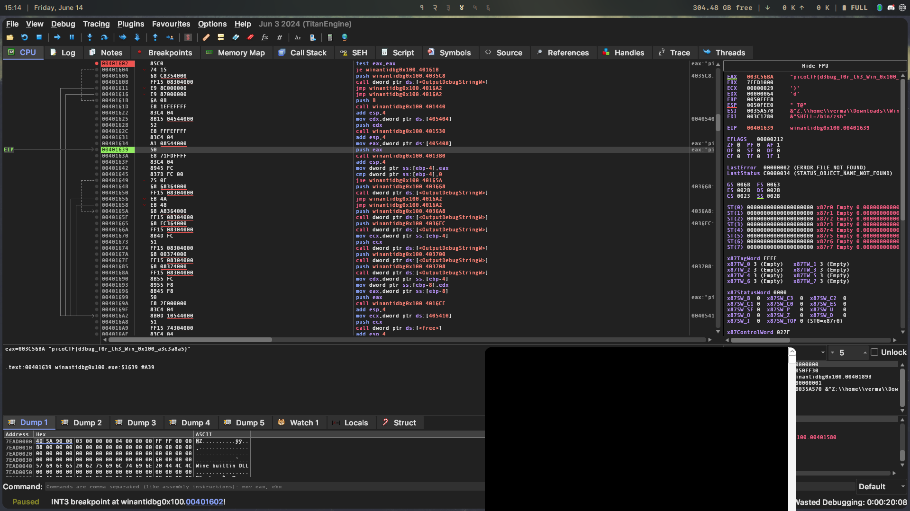
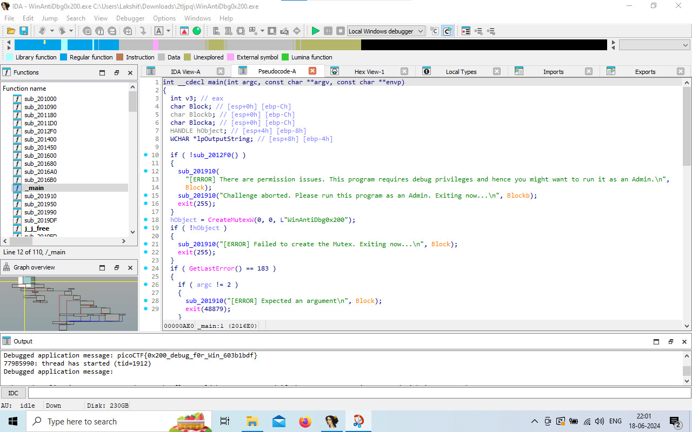

# WinAntiDbg 0x100

**Flag:** `picoCTF{d3bug_f0r_th3_Win_0x100_a3c3a8a5}`

Looking at the code with IDA, we find a function `IsDebuggerPresent` that presumably we need to bypass.

I fire up x64dbg and find the function near the offset `0x004015fc`. I see a `test eax, eax` instruction being executed and assumed it was what checked the flag. I set its ZF to 1 but I didn't get the flag.

Then, I tried the `je` instruction underneath it and set its ZF to 1. This worked, and after a few step throughs of the program we get the flag.

# WinAntiDbg 0x200

**Flag:** `picoCTF{0x200_debug_f0r_Win_603b1bdf}`

We're given a setup similar to before, but this time we need to set the ZF of two function returns to 1. Doing this in IDA, we get the flag.

