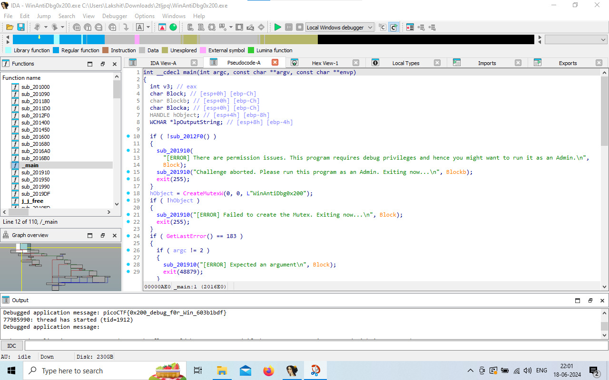

# WinAntiDbg 0x100

**Flag:** `picoCTF{d3bug_f0r_th3_Win_0x100_a3c3a8a5}`

Looking at the code with IDA, we find a function `IsDebuggerPresent` that presumably we need to bypass.

I fire up x64dbg and find the function near the offset `0x004015fc`. I see a `test eax, eax` instruction being executed and assumed it was what checked the flag. I set its ZF to 1 but I didn't get the flag.

Then, I tried the `je` instruction underneath it and set its ZF to 1. This worked, and after a few step throughs of the program we get the flag.


# WinAntiDbg 0x200

**Flag:** `picoCTF{0x200_debug_f0r_Win_603b1bdf}`

We're given a setup similar to before, but this time we need to set the ZF of two function returns to 1. Doing this in IDA, we get the flag.



# WinAntiDbg 0x300

**Flag:** `picoCTF{Wind0ws_antid3bg_0x300_aba8ee97}`

Running Detect-it-Easy on the binary, we see that its UPX packed. We first unpack it.

```
~/Downloads $ upx -d WinAntiDbg0x300.exe
                       Ultimate Packer for eXecutables
                          Copyright (C) 1996 - 2024
UPX 4.2.4       Markus Oberhumer, Laszlo Molnar & John Reiser    May 9th 2024

        File size         Ratio      Format      Name
   --------------------   ------   -----------   -----------
     75264 <-     26624   35.37%    win32/pe     WinAntiDbg0x300.exe

Unpacked 1 file.
```

After that, we take it to IDA. We also find a PDB file included with it.

Running it for the first time, we find a message that the debugger was detected. Finding the instruction that does this and inverting it, we get a slightly different message stating the same.

Digging into the content of the first message via IDA's Strings feature, we find the code that executes the check to be in a for loop, and a print-flag function. We modify its assembly to directly jump to the function that decrypts and prints the flag.

Then, after applying these changes to the original program, we run it again and get the flag.


